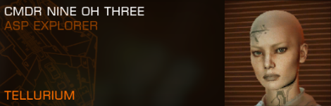

# elite.css

A CSS file for building UIs that resemble the ingame Elite Dangerous iconic orange menus, in case you want to bring your web fancontent closer to the homely COVAS feel.

[Documentation](http://neiva.rs/elitecss/)

🚀 Huge shoutout to [Elite Dangerous Assets](https://edassets.org/). They host a wealth of high-quality fanmade raster and vector graphics from the game's UI.

## Work in Progress

These styles are a work in progress. A lot still needs to be designed.

Some good CSS-framework level documentation will also emerge, hopefully.

## Installation

### CSS Release

Grab the latest `elite.css` or `elite.min.css` file release and link it in your HTML. The classes are now available to you, namespaced under `ed-*`.

### Build from SASS

If you want to tweak the css output, customize it or just break it, then you'll [need SASS first](https://sass-lang.com/install).

After installing SASS, clone the repo and output the `elite.css` with

```bash
$ sass src/scss/elite.scss dist/css/elite.css
```

For the minified version, use the `--style` flag with `compressed`.

```bash
$ sass src/scss/elite.scss dist/css/elite.min.css --style compressed
```

`elite.scss` is the entry point of all other SASS partials and pieces.

## License

MIT

## Copyright

I am not affiliated with Frontier Developments. This is a personal project.

Elite © 1984 David Braben & Ian Bell. Frontier © 1993 David Braben, Frontier: First Encounters © 1995 David Braben and Elite Dangerous © 1984 - 2021 Frontier Developments Plc. All rights reserved. 'Elite', the Elite logo, the Elite Dangerous logo, 'Frontier' and the Frontier logo are registered trademarks of Frontier Developments plc. Elite Dangerous: Odyssey and Elite Dangerous: Horizons are trademarks of Frontier Developments plc. All rights reserved. ‘PlayStation Family’, ‘PlayStation’, and ‘PS4’ are registered trademarks or trademarks of Sony Interactive Entertainment Inc. All other trademarks and copyright are acknowledged as the property of their respective owners.

## Commander



See you out there in the black, commanders. `o7`
